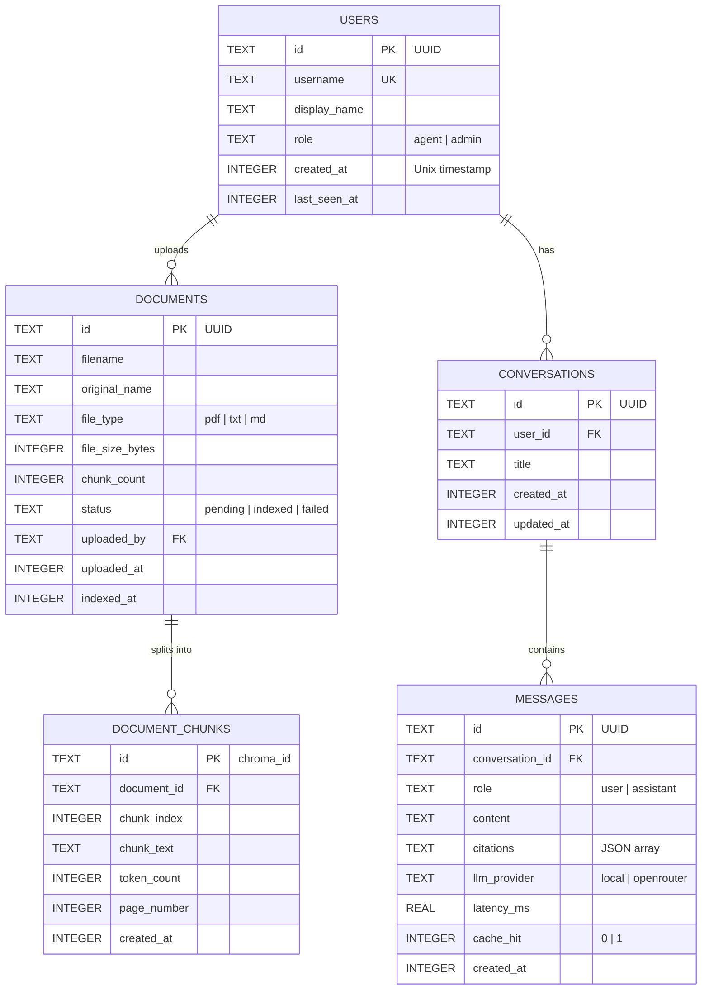

# Database Design
## AI Customer Support Assistant

**Version:** 1.0 | **Date:** June 2026

---

## 1. Overview

The system uses two persistence layers:
- **SQLite** — relational data (users, documents, conversations, messages)
- **ChromaDB** — vector embeddings (document chunks for semantic search)
- **Redis** — ephemeral cache (not modelled as a database; key schema documented below)

---

## 2. Entity Relationship Diagram



---

## 3. Table Definitions

### 3.1 `users`

```sql
CREATE TABLE users (
    id           TEXT PRIMARY KEY DEFAULT (lower(hex(randomblob(16)))),
    username     TEXT NOT NULL UNIQUE,
    display_name TEXT NOT NULL,
    role         TEXT NOT NULL DEFAULT 'agent' CHECK(role IN ('agent', 'admin')),
    created_at   INTEGER NOT NULL DEFAULT (unixepoch()),
    last_seen_at INTEGER
);
```

### 3.2 `documents`

```sql
CREATE TABLE documents (
    id               TEXT PRIMARY KEY DEFAULT (lower(hex(randomblob(16)))),
    filename         TEXT NOT NULL,
    original_name    TEXT NOT NULL,
    file_type        TEXT NOT NULL CHECK(file_type IN ('pdf', 'txt', 'md')),
    file_size_bytes  INTEGER NOT NULL,
    chunk_count      INTEGER DEFAULT 0,
    status           TEXT NOT NULL DEFAULT 'pending' CHECK(status IN ('pending','indexed','failed')),
    uploaded_by      TEXT NOT NULL REFERENCES users(id),
    uploaded_at      INTEGER NOT NULL DEFAULT (unixepoch()),
    indexed_at       INTEGER
);
```

### 3.3 `conversations`

```sql
CREATE TABLE conversations (
    id         TEXT PRIMARY KEY DEFAULT (lower(hex(randomblob(16)))),
    user_id    TEXT NOT NULL REFERENCES users(id),
    title      TEXT,
    created_at INTEGER NOT NULL DEFAULT (unixepoch()),
    updated_at INTEGER NOT NULL DEFAULT (unixepoch())
);
```

### 3.4 `messages`

```sql
CREATE TABLE messages (
    id              TEXT PRIMARY KEY DEFAULT (lower(hex(randomblob(16)))),
    conversation_id TEXT NOT NULL REFERENCES conversations(id),
    role            TEXT NOT NULL CHECK(role IN ('user', 'assistant')),
    content         TEXT NOT NULL,
    citations       TEXT DEFAULT '[]',  -- JSON: [{doc_id, chunk_id, source_name, page}]
    llm_provider    TEXT,               -- 'local' | 'openrouter'
    latency_ms      REAL,
    cache_hit       INTEGER DEFAULT 0 CHECK(cache_hit IN (0,1)),
    created_at      INTEGER NOT NULL DEFAULT (unixepoch())
);
```

### 3.5 `document_chunks`

```sql
CREATE TABLE document_chunks (
    id           TEXT PRIMARY KEY,   -- matches ChromaDB chunk id
    document_id  TEXT NOT NULL REFERENCES documents(id),
    chunk_index  INTEGER NOT NULL,
    chunk_text   TEXT NOT NULL,
    token_count  INTEGER,
    page_number  INTEGER,
    created_at   INTEGER NOT NULL DEFAULT (unixepoch())
);
```

---

## 4. Index Strategy

```sql
-- Hot paths: query by user, conversation lookup
CREATE INDEX idx_conversations_user_id ON conversations(user_id);
CREATE INDEX idx_messages_conversation_id ON messages(conversation_id);
CREATE INDEX idx_messages_created_at ON messages(created_at);
CREATE INDEX idx_documents_status ON documents(status);
CREATE INDEX idx_document_chunks_document_id ON document_chunks(document_id);
```

---

## 5. ChromaDB Collection Schema

ChromaDB is the vector store. One collection: `documents`.

```python
collection = client.get_or_create_collection(
    name="documents",
    metadata={"hnsw:space": "cosine"}
)

# Each entry:
# id:        "{document_id}_{chunk_index}"
# embedding: List[float]  (1536-dim for OpenAI, 384-dim for local)
# document:  chunk_text
# metadata: {
#     "document_id":   str,
#     "source_name":   str,   # original filename
#     "page_number":   int,
#     "chunk_index":   int,
#     "file_type":     str
# }
```

**Query pattern:**

```python
results = collection.query(
    query_embeddings=[query_vector],
    n_results=3,
    include=["documents", "metadatas", "distances"]
)
```

---

## 6. Redis Key Schema

| Key Pattern | Value | TTL | Purpose |
|-------------|-------|-----|---------|
| `cache:query:{sha256(query)}` | JSON string (full response + citations) | 3600s | Query response cache |
| `session:{session_id}` | JSON (conversation_id, user_id) | 86400s | Session state |
| `health:llm` | `"ok"` or `"degraded"` | 30s | LLM health flag |

---

## 7. Retention Policies

| Data | Retention | Action |
|------|-----------|--------|
| Messages | 90 days | Delete via nightly script (`DELETE FROM messages WHERE created_at < unixepoch() - 7776000`) |
| Documents | Until manually deleted | Admin API endpoint |
| ChromaDB vectors | Sync with document deletion | Delete by `document_id` filter |
| Redis cache | TTL-based eviction | Automatic |
| SQLite file | Full backup weekly | `sqlite3 app.db ".backup backup/app_$(date +%Y%m%d).db"` |

---

## 8. Migration Strategy

Migrations managed with **Alembic** (SQLAlchemy backend):

```
migrations/
  versions/
    001_initial_schema.py
    002_add_cache_hit_to_messages.py
```

Apply with: `alembic upgrade head`
Rollback with: `alembic downgrade -1`
