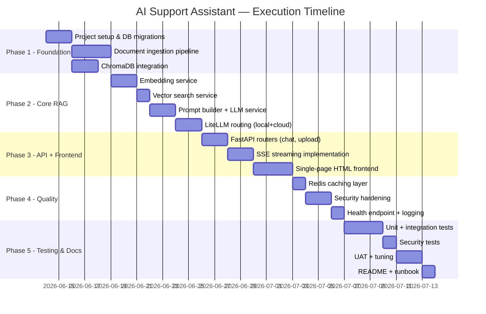

# Execution Plan
## AI Customer Support Assistant

**Version:** 1.0 | **Total Duration:** 5 Weeks  
**Team:** 1–2 engineers

---

## 1. Milestones Overview



---

## 2. Epics & Features

### EPIC 1 — Project Foundation

| Feature | Tasks | Effort | Dependencies |
|---------|-------|--------|-------------|
| F1.1 Repo setup | Init repo, `.env.example`, `Makefile`, `setup.sh` | 2h | — |
| F1.2 DB schema | SQLite tables, Alembic migrations | 3h | F1.1 |
| F1.3 Config layer | `pydantic-settings` config, all env vars | 2h | F1.1 |
| F1.4 Logging setup | `structlog` JSON logger, redaction filter | 2h | F1.1 |

### EPIC 2 — Ingestion Pipeline

| Feature | Tasks | Effort | Dependencies |
|---------|-------|--------|-------------|
| F2.1 Document parser | PDF (`pypdf`), TXT, MD text extraction | 4h | F1.2 |
| F2.2 Text chunker | Sliding window, overlap, token counting | 3h | F2.1 |
| F2.3 Embedding service | `sentence-transformers` local embed | 3h | F2.2 |
| F2.4 ChromaDB writer | Upsert chunks + metadata | 2h | F2.3 |
| F2.5 Ingest CLI | `scripts/ingest.py` for batch loading | 2h | F2.4 |

### EPIC 3 — RAG Query Pipeline

| Feature | Tasks | Effort | Dependencies |
|---------|-------|--------|-------------|
| F3.1 Vector search | ChromaDB cosine search, top-k retrieval | 3h | F2.4 |
| F3.2 Prompt builder | System prompt template, context injection | 2h | F3.1 |
| F3.3 LLM service | LiteLLM wrapper, local + cloud routing | 4h | F3.2 |
| F3.4 Stream controller | SSE token streaming, citation events | 4h | F3.3 |
| F3.5 Cache service | Redis get/set with SHA-256 keys | 3h | F3.4 |

### EPIC 4 — API Layer

| Feature | Tasks | Effort | Dependencies |
|---------|-------|--------|-------------|
| F4.1 Auth router | Login, session token, middleware | 3h | F1.2 |
| F4.2 Chat router | POST /chat with SSE | 3h | F3.4, F4.1 |
| F4.3 Document router | Upload, list, delete | 3h | F2.4, F4.1 |
| F4.4 Health router | Component checks | 2h | All services |
| F4.5 Rate limiting | `slowapi` middleware | 1h | F4.2 |
| F4.6 Input sanitiser | Injection pattern filter | 2h | F4.2 |

### EPIC 5 — Frontend

| Feature | Tasks | Effort | Dependencies |
|---------|-------|--------|-------------|
| F5.1 Chat UI | Message list, input, streaming display | 5h | F4.2 |
| F5.2 Citation display | Expandable source references | 2h | F5.1 |
| F5.3 Upload UI | Drag-drop file upload, status display | 3h | F4.3 |
| F5.4 Health indicator | Status badge (green/red) | 1h | F4.4 |

### EPIC 6 — Security & Quality

| Feature | Tasks | Effort | Dependencies |
|---------|-------|--------|-------------|
| F6.1 RBAC enforcement | Role checks on all admin endpoints | 2h | F4.1 |
| F6.2 CORS config | Localhost-only origin policy | 1h | F4.2 |
| F6.3 Secret hygiene | `.gitignore`, `.env` validation at startup | 1h | F1.3 |
| F6.4 Unit tests | All services, 80% coverage | 8h | EPIC 2-4 |
| F6.5 Integration tests | All API endpoints | 6h | EPIC 4 |
| F6.6 Security tests | Injection payloads, auth bypass | 3h | F4.6 |

### EPIC 7 — Documentation

| Feature | Tasks | Effort | Dependencies |
|---------|-------|--------|-------------|
| F7.1 README | Setup, run, ingest, config | 3h | All epics |
| F7.2 API docs | Auto-generated via FastAPI + Swagger UI | 1h | EPIC 4 |
| F7.3 Runbook | Backup, restore, LLM switching | 2h | All epics |

---

## 3. Critical Path

```
F1.1 → F1.2 → F2.1 → F2.2 → F2.3 → F2.4
                                        ↓
F1.3 → F3.1 → F3.2 → F3.3 → F3.4 → F4.2 → F5.1 → UAT
         ↑                     ↑
       F2.4                  F3.5 (Redis)
```

---

## 4. Resource Requirements

| Role | Hours | Notes |
|------|-------|-------|
| Full-Stack Engineer | ~80h | All epics |
| QA / Security Review | ~20h | EPIC 6 |
| Knowledge Manager | ~5h | Document preparation for UAT |

---

## 5. Risks & Mitigations

| Risk | Mitigation |
|------|------------|
| llama.cpp local inference too slow | Early spike test on target hardware; tune `n_threads`, `n_gpu_layers` |
| Embedding model choice impacts retrieval quality | Test `all-MiniLM-L6-v2` vs `bge-small-en-v1.5` on golden dataset |
| ChromaDB persistence issues | Pin chromadb version; test backup/restore in Week 1 |
| SSE streaming complexity in frontend | Use `EventSource` API; prototype early |

---

## 6. Definition of Done (per feature)

- [ ] Code implements spec (BRD + SystemArchitecture)
- [ ] Unit tests pass (≥ 80% coverage on new code)
- [ ] No linting errors (`ruff check`)
- [ ] No type errors (`mypy`)
- [ ] Security controls applied (input sanitised, auth enforced)
- [ ] Structured log events emitted for happy path + error path
- [ ] README updated if configuration changes
