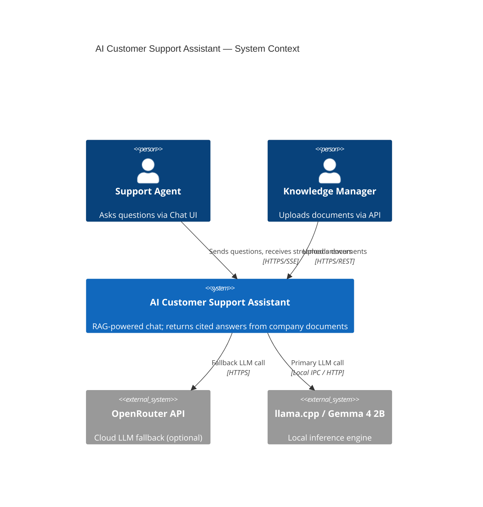
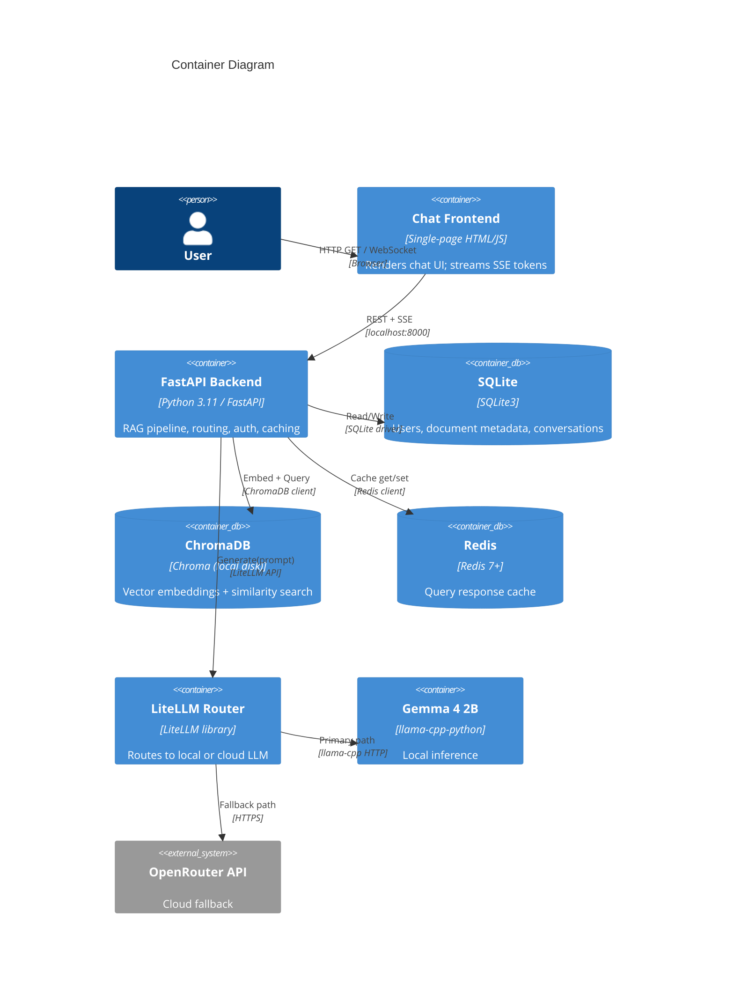
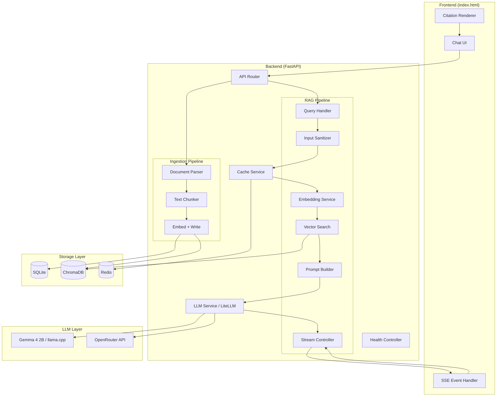
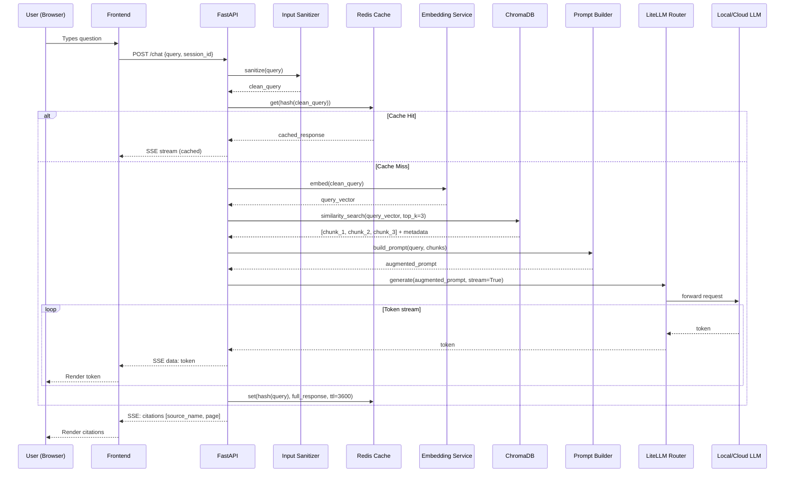
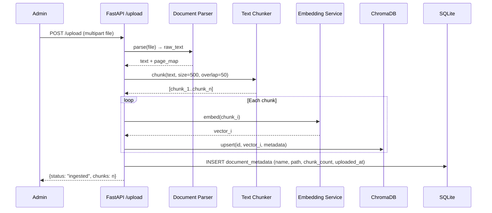
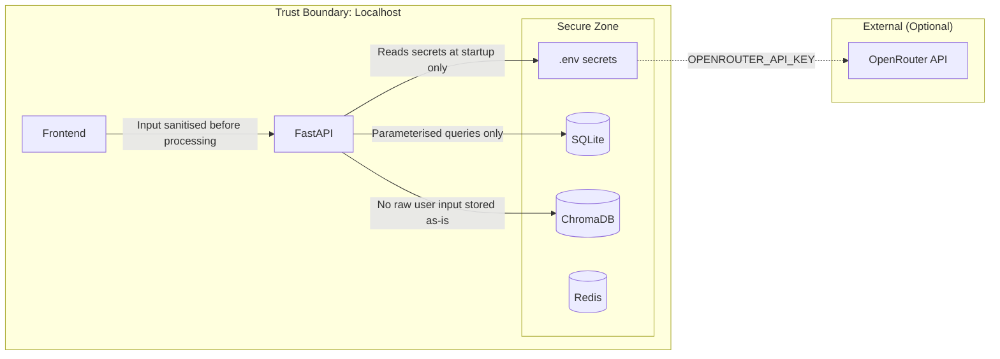

# System Architecture
## AI Customer Support Assistant

**Version:** 1.0 | **Date:** June 2026

---

## 1. Architecture Overview

The system follows a **Modular Monolith** pattern — all components run in a single Python process on one machine, structured into clearly separated modules. This avoids Docker while maintaining clean architectural boundaries.

**Key principles:**
- RAG pipeline as first-class citizen (not a plugin)
- LLM routing abstracted behind LiteLLM interface
- All persistence layers injectable/swappable
- Security-by-design at every layer boundary

---

## 2. Context Diagram



---

## 3. Container Diagram



---

## 4. Component Diagram



---

## 5. Data Flow Diagram — Query Path



---

## 6. Data Flow Diagram — Ingestion Path



---

## 7. Deployment Diagram

```
┌─────────────────────────────────────────────────────────────────┐
│                     Single Host Machine                          │
│                                                                  │
│  ┌──────────────┐   ┌──────────────────────────────────────┐   │
│  │  Browser     │   │  Python Process (uvicorn, port 8000) │   │
│  │  localhost   │──▶│  FastAPI Application                 │   │
│  │  :8000       │   │  ├── routers/                        │   │
│  └──────────────┘   │  ├── services/                       │   │
│                      │  │    ├── rag_service.py             │   │
│                      │  │    ├── llm_service.py (LiteLLM)  │   │
│                      │  │    ├── cache_service.py           │   │
│                      │  │    └── ingest_service.py         │   │
│                      │  └── models/                        │   │
│                      └──────────────────────────────────────┘   │
│                               │                                  │
│          ┌────────────────────┼────────────────────┐            │
│          ▼                    ▼                    ▼            │
│  ┌──────────────┐  ┌───────────────────┐  ┌──────────────┐    │
│  │  SQLite      │  │  ChromaDB         │  │  Redis       │    │
│  │  app.db      │  │  ./chroma_db/     │  │  localhost   │    │
│  │  (file)      │  │  (local disk)     │  │  :6379       │    │
│  └──────────────┘  └───────────────────┘  └──────────────┘    │
│                                                                  │
│  ┌──────────────────────────────────────┐                       │
│  │  llama.cpp server (port 8080)        │                       │
│  │  Model: gemma-4-2b-instruct.gguf    │                       │
│  └──────────────────────────────────────┘                       │
│                                                                  │
└─────────────────────────────────────────────────────────────────┘
              │ (Optional, when LLM_PROVIDER=openrouter)
              ▼
      ┌───────────────┐
      │  OpenRouter   │
      │  API (Cloud)  │
      └───────────────┘
```

---

## 8. Security Architecture



**Security controls summary:**
- API keys in `.env`, never in code or logs
- All user inputs pass through `InputSanitizer` before prompt construction
- SQLite queries use parameterised statements
- Redis keys are hashed (SHA-256) — no PII in cache keys
- CORS restricted to `localhost` origin
- Rate limiting via FastAPI middleware (60 req/min default)

---

## 9. High Availability Design

Single-node deployment — no HA requirement. Resilience is handled by:
- **Redis failure:** Cache service catches `ConnectionError` and falls through to LLM
- **LLM failure:** LiteLLM catches timeout; switches provider if fallback configured
- **ChromaDB failure:** Returns HTTP 503 with descriptive error
- **SQLite failure:** Returns HTTP 503; no data loss (read-only during query)

---

## 10. Scalability Design

The current architecture targets < 20 concurrent users. Scaling path if needed:

| Step | Change |
|------|--------|
| 1 | Add `uvicorn --workers N` for CPU parallelism |
| 2 | Replace SQLite with PostgreSQL |
| 3 | Replace local Chroma with Weaviate or Pinecone |
| 4 | Deploy behind Nginx reverse proxy |
| 5 | Containerise with Docker Compose |
